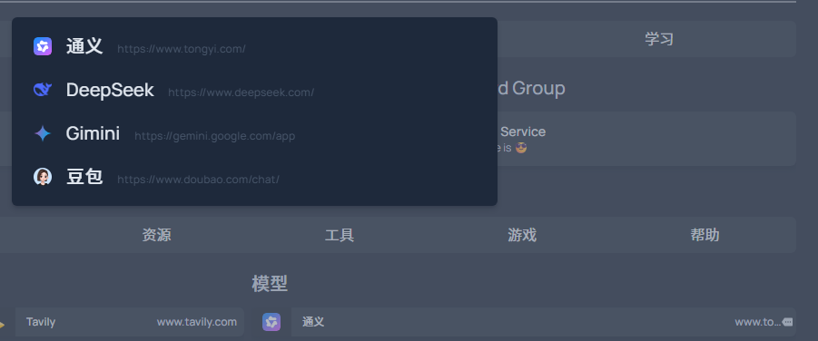

# 原始项目

[Github](https://github.com/gethomepage/homepage)
[Homepage](https://gethomepage.dev/)

# 修改内容

- [x] `maxGroupColumns` 设置多列书签
- [x] 书签省略 `icon` 与 `abbr` 属性时自动获取图标
- [x] 为书签添加独立的 Tab，通过 `settings.layout` 对应 `group` 中的 `bookmarkTab` 属性设置

```yaml
layout:
  _b_ai_tool:
    name: 工具
    bookmarkTab: AI
```

- [x] 书签具有二级菜单，通过 `bookmarks` 中的 `sublist` 属性配置

```yaml
- _b_ai_model:
  - 通义:
    - href: https://www.tongyi.com/
      sublist:
        DeepSeek:
          href: https://www.deepseek.com/
          icon: deepseek
        Gimini:
          href: https://gemini.google.com/app
          icon: google-gemini
        豆包:
          href: https://www.doubao.com/chat/
```



- [x] 加密 Tab

在 `settings.yaml` 中添加 `passwords` 属性即可。

**注意，密码不会隐藏从服务器获取的 `bookmarks.yaml` 或 `service.yaml` 中的内容**

```yaml
layout:
  fullWidth: true
  _s_manager:
    tab: 管理
  _b_help_proxy:
    name: 代理
    bookmarkTab: 帮助

passwords:
  serviceTabs:
    管理:
      password: lq2007
  bookmarkTabs:
    帮助:
      password: lq2007
```

- [ ] 在页面添加书签
- [ ] 备忘录
